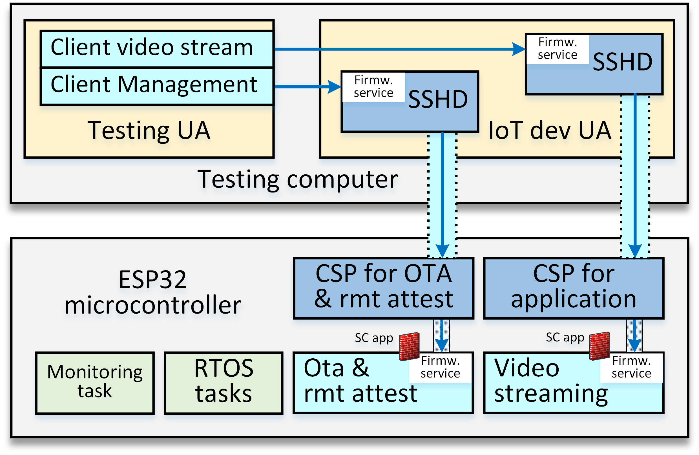
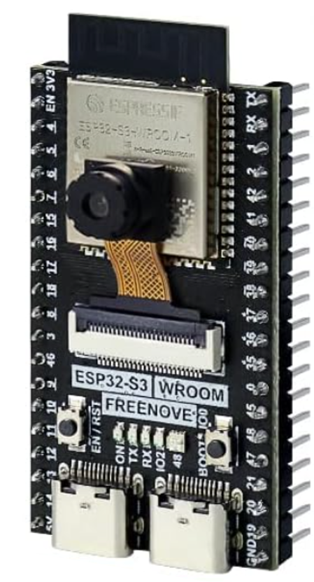

# CMXsafe-ESP32S3-example

This project is an implementation example of securing modular proxying components for task communications in FreeRTOS ESP32-based applications. The application secured is the [video streaming example](https://github.com/Freenove/Freenove_ESP32_S3_WROOM_Board/tree/main/C/Sketches/Sketch_07.2_As_VideoWebServer) available for [Freenove ESP32-S3-WOWROOM-1 development board](https://www.espressif.com/sites/default/files/documentation/esp32-s3-wroom-1_wroom-1u_datasheet_en.pdf)

<p align="center">
  <br>
  <em>First, the Client Socket Proxy (CSP) in the ESP32-S3 establishes proxying sessions with the testing computer (a remote machine) through the SSH protocol. This allows the SSH server (SSHD) to set up reverse socket proxies of ESP32-S3 services to facilitate secure access to those services from within the testing computer.</em>
</p>

#### Example setup

This example has been tested on a Freenove ESP32-S3-WROOM-1 board configured with a 4MB flash ROM and no external PSRAM. It uses a generic OV2640 camera connected to the available Digital Video Port (DVP)

<p align="center">
  
</p>

- The securing of the original video streaming application is carried out by adding [a few lines](https://github.com/jdhozdiego/CMXsafe-ESP32S3-example/commit/ff984587acce33a8bed162f557806f3817c6a0ac) in the main `ino` project file according to [CMXsafe instructions](https://github.com/jdhozdiego/CMXsafe-ESP32)
- The application has two services: a web service (80) and a video streaming service (81). This example only proxies the video streaming service by [configuring the proxy](https://github.com/jdhozdiego/CMXsafe-ESP32S3-example/commit/74eb967d2aa626a9a96bbbe0e2e3a4426fe11fb9). The standard web service becomes unreachable and isolated as an example of surface attack reduction.
- [Monitoring functions have been added](https://github.com/jdhozdiego/CMXsafe-ESP32S3-example/commit/df2c795438f779290a966893bd7b98d01adcbdec) to evaluate the requirements of RAM, ROM, and CPU consumption.

To initialize the project, it should be cloned first, and then the CMXsafe submodule pulled as follows:

```sh
git clone https://github.com/jdhozdiego/CMXsafe-ESP32S3-example.git
git submodule update --init --recursive
```

Then, WIFI configurations should be set up (login/password) on the `ino` project file of the original VideoWebServer

```cpp
const char* ssid     = "********";   //input your wifi name
const char* password = "********";   //input your wifi passwords
```

After this, CMXsafe configurations should be set up in the settings.h file

```cpp
  #define SSH_REMOTE_HOST "172.20.10.4"  // Replace with your SSH server's IP or hostname
  #define SSH_LOCAL_HOST "127.0.0.1"     // Replace with your SSH local IP or hostname
  #define SSH_REMOTE_PORT 22             // SSH server port
  #define USERNAME1 "user"               // SSH username
  #define PASSWORD1 "password"           // SSH password (optional if using key authentication)
```

- `SSH_REMOTE_HOST`: computer running an SSH server where the ESP32S3 will connect.
- `SSH_REMOTE_PORT`: port of the SSH server
- `USERNAME1` and `PASSWORD1`: credentials to authenticate the device to the SSH server. This is the default authentication method, but KEY-based authentication is also allowed

Once the configurations are set, the ESP32-S3 will boot and establish the proxied connections in the server. The ESP32-S3 will discard any communication attempt addressed towards any of the potential services enabled in the firmware, except those configured on fw-ports.h files
- application `fw-ports.h`
```cpp
TaskParameters streamPort = {
    .local_port = 81,
    .forward_remote_port = 81,
    .high_bw = true,
};
```

- management `CMXsafe\fw-ports.h`
```cpp
TaskParameters otaPort = {
    .local_port = 8989,
    .forward_remote_port = 8989,
    .high_bw = false,
};

TaskParameters attestationPort = {
    .local_port = 8888,
    .forward_remote_port = 8888,
    .high_bw = false,
};
```

Those three proxied services can be tested from within the server as follows:

- Secured Streaming application
```sh
#From a web browser within the testing machine
http://127.0.0.1:81/stream
```

- Secured Over The Air (OTA) update
```sh
#From a terminal in the testing machine
curl -X POST -F "update=@firmware.bin" http://127.0.0.1:8989/update
```

- Remote attestation of identity and firmware integrity
```sh
#From a terminal in the testing machine
curl -X GET http://127.0.0.1:8888/hash?challenge=string_to_use_as_challenge

#Validating the hash requires having a valid image of the ROM
python3 CMXsafe/remote_attestation.py string_to_use_as_challenge
```

A further detailed explanation on how OTA and remote attestation operate can be found on the [CMXsafe-ESP32 repository](https://github.com/jdhozdiego/CMXsafe-ESP32/tree/9f1309c1cee516545aca9c400129a118b9c2220f)

## Licensing and Funding

This software is licensed under the BSD 3-Clause Clear License, which permits open access and reuse according to the principles of the Marie Skłodowska-Curie Actions under Horizon Europe.

> **Funding Acknowledgment**  
> This work was supported by the European Union’s Horizon Europe research and innovation programme under the Marie Skłodowska-Curie Actions grant agreement No. 101149974 ([Project CMXsafe](https://cordis.europa.eu/project/id/101149974)).

